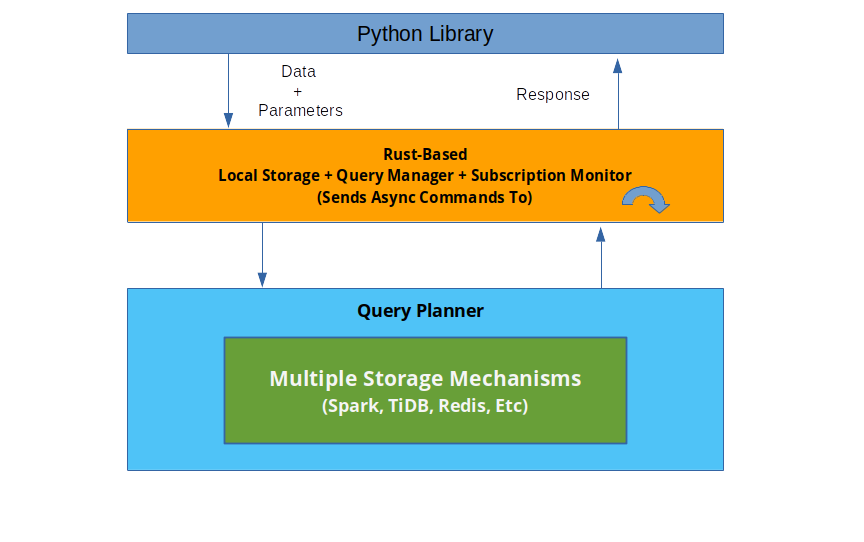

# Underbelly Design Doc

**`Underbelly`** is the rust layer to the library `jamboree`. The entire point of it is to isolate the calls from the original layer and have a place to experiment with new designs. The point is to create a fully integrated systems level environment to test complex distributed OpenAI gym designs and run them in production from your laptop to a giant cluster for thousands of computers. I'll explain how it should work in this document.

After writing `Jamboree` and experiencing many of the drawbacks of my design decisions. I dreamt up a super system of sorts that will be easily able to do millions of complex iterations at extremely high speeds without having to think too much about transfering code to lower level languages and writing raw database queries. The system would look a lot like the diagram below. The idea is to have a fully integratable system to deploy your environment to. All parts of the system would be optimized to talk to each other allowing for extremely high speed programs with minimal configuration. You wouldn't have to think about schemas, formatting your data, networking overhead, joins, pushing data to your dataframe, huge download times for large data sets, and transferring models.

The system design would look like this:

The key part, underbelly, is the middle layer between the database system and main analytics system. That system will:
1. Format queries for the database.
1. Store local variables according to the parameters set.
    1. Highly reads, low write data
        1. This is extremely useful for keeping a synchronised state acorss multiple parts of a backtest.
    1. Model parameters
1. Background subscriptions to data to temporarily store local copies of records from the Query Engine
    1. This is useful for backtesting.
        1. Allows one to share data without having to pool the database constantly. Extremely useful for sharing time between system components in real-time.

That being said. It's impractical to get all of this at once. What I'm going to do is write design documents and run experiments converging around two important tasks:

1. Manage orders and brokers dynamically for multiple episodes at once.
1. Send multiple variables to get monitored.

These will have a python front-end and will use rust underneath the surface. If I can successfully finish them, and create a good design for them, that'll be the foundation for writing more.

## Methodology

First things first I'm going to create a detailed design doc for each one of the two points. This is not for communication, this is so I can gain absolute clarity of what I'm doing for each part task.

Once I'm done with that I'm going to finish the workflow for each of these tasks using Python 100%. This is to avoid confusion and not face the compiler's wrath when I get to it. I'll be completing both tasks using local storage, then expand up to Redis after.

Once I have them working I'll spend a decent chunck of time getting the code to run faster. I'll likely integrate the changes to my system before the changes are seen elsewhere.

**A Note:**

I wrote a detailed rant inside of the docs folder. The rants come from another project that is related to this one. To see more about it click the link below.

[Distributed state space management (frustrations + solutions)](./design/FRUSTRATIONS.md)

