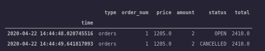

# Order System

The portfolio order management system is notably the complex component of the event driven backtesting system. Its reponsible for:

1. To keep track of the state of all orders for a given user.
1. Communicate with the broker/exchange.
1. Keep track of the history of orders to do analytics on.
1. Have some rules to drop orders if they turn out to linger too long.
1. Provide information for the total value of the portfolio (open positions that can't be used).
1. Keep track of the slippage of orders.
1. Account for errors that happen.
1. Change the state of the system when the order is filled.
    1. Dealing with the math and broker communication to determine that.


That's quite a lot of variables to track. In a general sense, if you're trying to run simulations that are considerate of all of the errors that happen in real-life you're in for quite a doozy. An RL agent needs to know how all of the possible functionality of a system to properly correct for the issues that could happen. Those issues are rather stochastic in nature. Ultimately, there's a reason this is one of my last 3 parts of the training system. It's way harder than it looks.

This is beautiful, however, compared to many of the other parts of the system it's the perfect level of difficulty. If one can properly manage it gracefully both on the DB end and OOP end you can have an exceptional framework to pull from.

## Designing Interactions

So far, I already have an exchange that keeps track of all pricing and the inital ordering math. In a vauge sense it operates like a conventional step function.


```python

exchange = Exchange()
# will step through a simulated trade by user, exchange, episode, etc.
# Pulls the information from the database first.
exchange.step(trade) 
```

Inside of that class I'm determining the order pricing and amount. It runs through a series of steps, where eventually it leads to the following part:

```python
def step(self, trade=None):
    order = self.size_order(trade) # runs through the variables specific to the portfolio
    self.execute_trade(order) # This sends the trade to a fake process. 
```

From `self.execute_trade` it's supposed to go to a broker and execute, then update the main portfolio about the current happenings.

In essense, if I wanted to check to see if the trade was completed I would call another command after we send the excution command. `self.update_trades`. That would target that specifc trader/portfolio. Combined with that piece of code the class should look like this code snippet:

```python
def update_trades(self):
    self.broker.update()

def update(self):
    # Run a bunch of other update functions
    self.update_trades() # Supposed to get the state of all trades
    # Update everything dependent on the trades ...


def step(self, trade=None):
    order = self.size_order(trade) # runs through the variables specific to the portfolio
    self.execute_trade(order) # This sends the trade to a fake process.
    self.update() # I already have update functions here
```

Not too complex eh? Yeah, you're right. This is the moment I realized I made a huge mistake. I didn't index my records and just used JSON instead. This lead to some extreme problems. I tagged data and indexed everything by time. This lead to some serious problems. I would have encountered this issue at some point, but I need to be able to locate and update statuses about data. All of this also needs to be an append only so you can track the history of interactions over time (for execution time and slippage, etc). This is rather scary in a way, there's a lot of objectives. By focusing only on the time and Object Oriented end I totally dropped the ball on the data access part.



## Orders In Real Life

1. Should have a pair of base and trade pair.
1. Need to be appended into the database with a reasonably high speed.
1. Need to search through orders.
    1. When searching for trades I need to get the latest in each indexable set. Translated: "Find all trades that are open" means it should return only the latest trade with that state.
    1. It shouldn't return the entire history, it should only return that trade if it there are no other trades with a different state.
1. I need to push the latest state.

Updating orders for real-life is as simple as using some online univariate statistics combined with some queries, but it doesn't feel so simple. It makes me realize that I should fix this problem is the fact that this problem comes up for many other parts of the system. This is a join and time series it would appear.


## Other Instances Of More Complex Orders

1. Get latest price information for the given user from the specified exchange.
1. Get the latest state of the user's balance from multiple exchanges.
1. Get the balanace of user from every exchange and the balance of each individual asset on those exchanges.
    1. This combines the two queries from above. It's fucking complicated.
1. Get all open balances on X exchange.
1. Return the total balance on a given exchange.

This is a set of joins/graphs I'm realizing. I need to do something about this stats. Before that I think I'm going to move over to the next document of pythonic designs. The python design not only needs to deal with the very basic commands of an order. It also needs to create interfaces to manage getting general/broad access to orders. It's what was missing. Go here for the python design. Once that's done I'm doing the database design. 